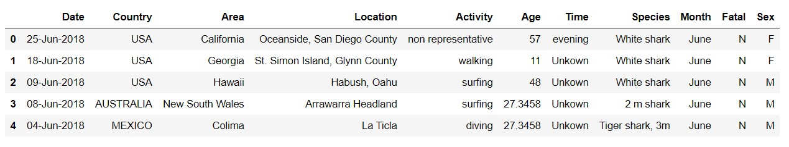
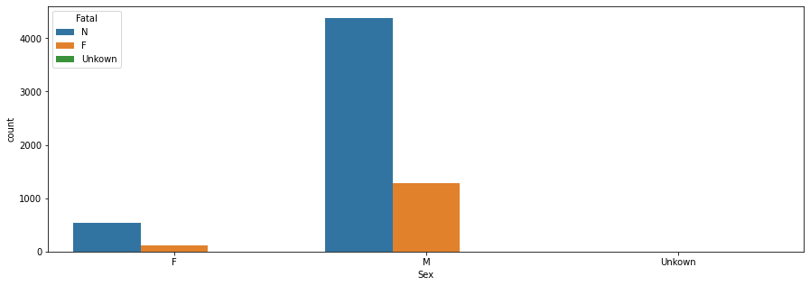
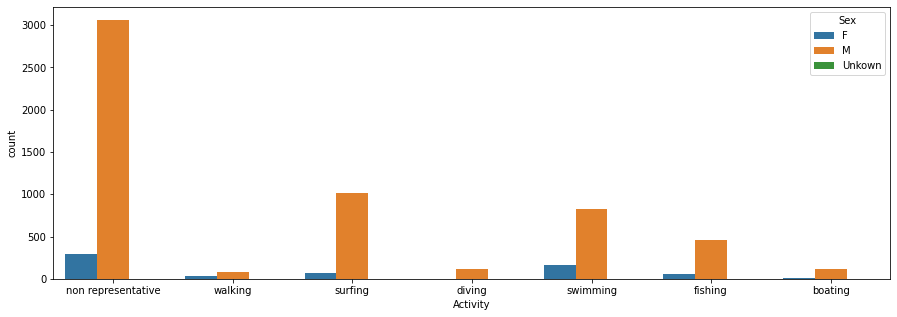
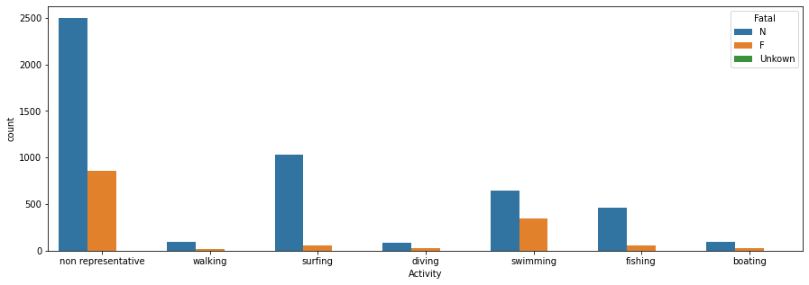
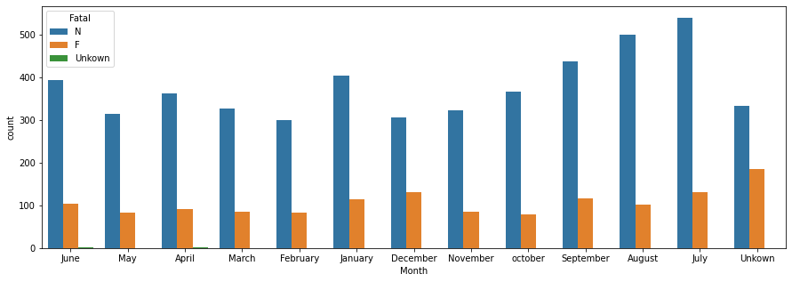

# Shark Attacks
## Objetivos:
1. Entender y explicar el dataset.
2. Decidir una hipótesis para limpiar los datos.
3. Apoyar los resultados con gráficas y explicaciones.
4. Hacer una conclusión.

## Columnas finales:

- 'Date'
- 'Month' 
- 'Country'
- 'Area'
- 'Location'
- 'Activity'
- 'Sex '
- 'Age'
- 'Fatal'
- 'Time'
- 'Species'

## Conclusions:
* 89.84% de los accidentes son reportados por hombres.

* Mientras que la actividad que mas realizan las mujeres es nadar, la que más realizan los hombres es el surf. Si unimos este dato con el hecho de que los hombres son los que más accidentes tienen, podemos concluir que puede deberse a que realizan más actividades acuaticas, incluida la que más accidentes recoge, el surf.

* La actividad más mortal es bañarse.
* La actividad que recoge el mayor número de accidentes con tiburones no mortal es surfear.
 
* El tiburón que más ataca es el tiburón blanco.
* Agosto y julio son los meses en los que hay más accidentes. 
 