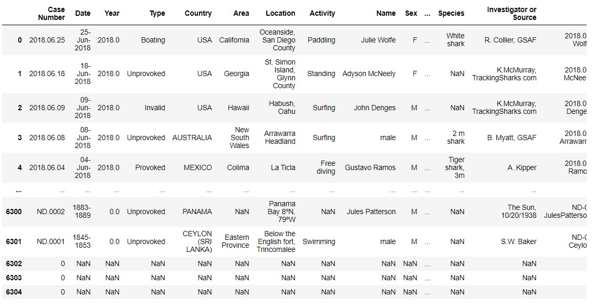

# Shark Attacks
## Objectives
We will analyze a dataset from shark attacks. Our objectives are:
1. Understand and explain the dataset.
2. Decide and hypothesis to clean the data.
3. Support the results with graphs and explanations.
4. Make a conclusion.

## Understand the dataset:

The original columns are:
- 'Case Number'
- 'Date'
- 'Year' 
- 'Type'
- 'Country'
- 'Area'
- 'Location'
- 'Activity'
- 'Name'
- 'Sex '
- 'Age'
- 'Injury'
- 'Fatal (Y/N)'
- 'Time'
- 'Species '
- 'Investigator or Source'
- 'pdf'
- 'href formula' 
- 'href','Case Number.1'
- 'Case Number.2'
- 'original order'
- 'Unnamed: 22'
- 'Unnamed: 23'

